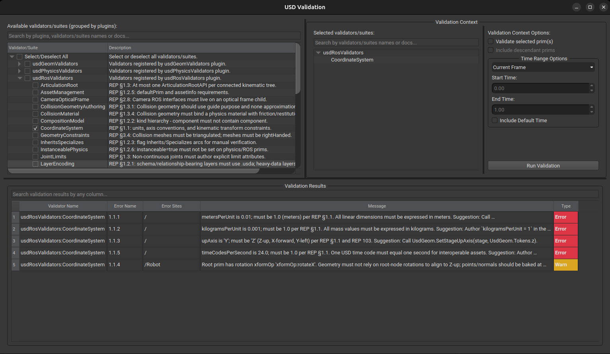

# ROS OpenUSD Interoperability Compliance Checker

> [!NOTE]
> This project is a proof of concept developed using agentic coding.

Validate OpenUSD assets against REP-0158 interoperability rules for
simulation, ROS integration, and export portability.

The checker ships its validators in two interchangeable forms that share
the same `plugInfo.json` and the same implementation modules:

- **`usd-check`** — a pure-Python CLI installable from PyPI. Works in any
  Python 3.12+ environment with no OpenUSD build required (`usd-core` brings
  the `UsdValidation` framework along on pip). Suited to quick local checks
  and lightweight CI workers.
- **`usdRosValidators`** — a USD plugin discoverable via standard plugin
  loading. Studios with a full OpenUSD install can run the same validators
  through stock `usdchecker`. Suited to integrating with an existing USD
  asset pipeline.

> [!TIP]
> Run the checker on any asset without cloning\*:
>
> ```bash
> uvx --from ros-openusd-compliance-checker usd-check <asset.usd>
> ```
>
> \* uv must be installed first:
>
> ```bash
> curl -LsSf https://astral.sh/uv/install.sh | sh
> ```

## Installation

```bash
pip install ros-openusd-compliance-checker
```

## Usage

```bash
usd-check [OPTIONS] ASSET
```

By default only the **core** checks run (REP §1 and §2: units, structure,
physics, and the five base ROS schemas — `RosContextAPI`, `RosTopicAPI`,
`RosServiceAPI`, `RosActionAPI`, `RosFrameAPI`).

| Flag           | What it adds                                                  |
| -------------- | ------------------------------------------------------------- |
| _(default)_    | §1 units/structure/physics + §2 core ROS schemas              |
| `--export`     | §3 export/conversion checks (mesh, texture, material; slower) |

```bash
# Core checks only (default)
usd-check robot.usda

# Core + export checks
usd-check robot.usda --export
```

## Running through USD CLI tools (`usdchecker`, `usdview`)

The same validators are packaged as the `usdRosValidators` plugin and can
be invoked through stock `usdchecker` or surfaced in `usdview`'s built-in
Validation panel. This requires a full OpenUSD install (≥ v26.05) — these
binaries ship with a source build, not with the pip-distributed `usd-core`.

Two env vars are needed. The plugin is `Type: "python"`, so USD must both
discover its manifest and import its module:

```bash
# Discovery: where the plugin's plugInfo.json lives
export PXR_PLUGINPATH_NAME=/path/to/openusd-schemas/tools/compliance_checker/usdRosValidators

# Import: the parent dir so `import usdRosValidators` resolves
export PYTHONPATH=/path/to/openusd-schemas/tools/compliance_checker:$PYTHONPATH
```

Note the level-of-nesting difference: `PXR_PLUGINPATH_NAME` points at the
`usdRosValidators/` directory itself; `PYTHONPATH` points at its parent.

Then run either tool:

```bash
# Headless / CLI
usdchecker robot.usda --includeKeywords rep0158

# Interactive — once usdview is open, choose Window > USD Validation; the
# `usdRosValidators` group appears in the plugin tree
usdview robot.usda
```

In `usdview`, the panel groups our validators under `usdRosValidators` and
surfaces each REP-0158 docstring inline. Selecting one (or the whole group)
and pressing **Run Validation** populates the **Validation Results** table
below with each error's name, error code, prim site, message, and severity:



Three keyword filters are available (selectable via `--includeKeywords` in
`usdchecker`, or via the search box in `usdview`'s Validation panel):

| Keyword              | Selects                                                     |
| -------------------- | ----------------------------------------------------------- |
| `rep0158`            | every validator in this plugin (REP-0158 identity)          |
| `rep0158:<section>`  | a single REP section, e.g. `rep0158:1.1`, `rep0158:2.4`     |
| `UsdRosValidators`   | every validator in this plugin (USD plugin-name identity)   |

Error lines from `usdchecker` follow the shape
`(usdRosValidators:<ValidatorName>.<ErrorCode>) <message>`. Exit code is
non-zero when any error-severity violation is reported.

## Developer Setup

### Install uv

```bash
curl -LsSf https://astral.sh/uv/install.sh | sh
```

## Install repository

```bash
git clone https://github.com/ros-simulation/openusd-schemas.git
cd openusd-schemas/tools/compliance_checker
```

### Install dependencies

```bash
uv sync --all-packages
```

### Run tests

```bash
uv run pytest
```

### Run pre-commit

```bash
uv run pre-commit
```
